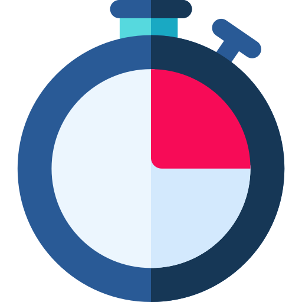

<p align="center" style="text-align:center">
    
</p>

# debounce-wrapper

> Function that calls only the last function from the chain of calls with an interval less than the specified time

[](https://www.npmjs.com/package/debounce-wrapper)
[](https://www.jsdelivr.com/package/npm/debounce-wrapper)


## Table of Contents

- [Quick start](#quick-start)
  - [Install](#install)
  - [Initialization](#initialization)
- [Methods](#methods)
  - [debounce](#debounce)

## Quick start

### Install

We support all platforms.

#### npm

For module bundlers such as Webpack or Browserify.

```shell
npm i debounce-wrapper
```

#### Include with &lt;script&gt;

1. <a href="https://cdn.jsdelivr.net/npm/debounce-wrapper/dist/lib/debounce-wrapper.js" target="_blank">Download lib</a>
2. Add script to html

```html
<script src="debounce-wrapper.js"></script>
```

##### CDN

Recommended for learning purposes, you can use the latest version:

```html
<script src="https://cdn.jsdelivr.net/npm/debounce-wrapper/dist/lib/debounce-wrapper.js"></script>
```

Recommended for production for avoiding unexpected breakage from newer versions:

```html
<script src="https://cdn.jsdelivr.net/npm/debounce-wrapper@0.0.0/dist/lib/debounce-wrapper.js"></script>
```

### Initialization

#### ES6

debounce-wrapper as an ES6 module.

```js
import debounce from 'debounce-wrapper';

let result = [],
    fn = (number) => result.push(number),
    callFnWithDebounce = debounce(fn, 500)

    callFnWithDebounce(1)
    setTimeout(() => callFnWithDebounce(2),300)

    setTimeout(() => console.log(result),350)


```

#### Node

debounce-wrapper as a Node.js module

```js
const debounce = require('debounce-wrapper');

let result = [],
    fn = (number) => result.push(number),
    callFnWithDebounce = debounce(fn, 500)

    callFnWithDebounce(1)
    setTimeout(() => callFnWithDebounce(2),300)

    setTimeout(() => console.log(result),350)

```

#### Browser

Exports a global variable called `debounce`. Use it like this

Connect to html file ```<script src="https://cdn.jsdelivr.net/npm/debounce-wrapper/dist/lib/debounce-wrapper.js" ></script>```

```html
<script>

    var result = [],
        fn = (number) => result.push(number),
        callFnWithDebounce = debounce(fn, 500)

    callFnWithDebounce(1)
    setTimeout(() => callFnWithDebounce(2),300)

    setTimeout(() => console.log(result),350)

</script>
```

#### AMD

debounce-wrapper as an AMD module. Use with Require.js, System.js, and so on.

1. <a href="https://cdn.jsdelivr.net/npm/debounce-wrapper/dist/lib/debounce-wrapper.js" target="_blank">Download lib</a>
2. Connect to your module loader

```js
requirejs(['debounce-wrapper'], function(debounce) {

    var result = [],
        fn = (number) => result.push(number),
        callFnWithDebounce = debounce(fn, 500)

        callFnWithDebounce(1)
        setTimeout(() => callFnWithDebounce(2),300)

        setTimeout(() => console.log(result),350)

});
```

## Methods

### debounce

Function wrapper, that cancels the previous function call, if time between previous and current call less than ms


#### Params
- `fn`
  - Type: `Fn`
  - Description: function that will be called after ms
- `ms`
  - Type: `number`
  - Description: time out, after which fn will call

#### Returns
- `ReturnedFn`

#### Example
```JS
let result = [],
    fn = (number) => result.push(number),
    callFnWithDebounce = debounce(fn, 500)

    callFnWithDebounce(1)
    setTimeout(() => callFnWithDebounce(2),300)

    console.log(result) // => [2]
```


## Author

webster6667
